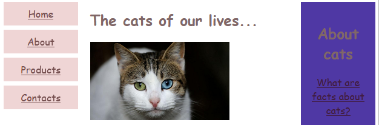

# Laborator 1

A realizat: **Curmanschii Anton, IA1901.**

Tema: **Adaptivitatea cu CSS3, Media Queries**


## Metoda 1.1 (css_RWD1/css/styles)


Elementul `meta name="viewport"` lipsește:
```html
<!-- <meta name="viewport" content="width=device-width, initial-scale=1.0" /> -->
```

Din această cauză pe ecrane mici apare problema:


```css
* {
  box-sizing: border-box;
}
```

`content-box` este default și aplică proprietățile `width` și `height` înainte de a călcula mărimea bordurii, pe când
`border-box` o calculează înainte de a le aplica. 


```css
.menu {
  float: left;
  width: 20%;
}

.main {
  float: left;
  width: 60%;
}

.right {
  float: left;
  width: 20%;
}

```

Acest cod definiște layout-ul celor 3 boxe, una cu meniul, una cu contentul, și încă una pe partea dreaptă.
Meniul și boxa din dreapta va ocupa $ \frac{1}{5} $ a spațiului, iar contentul principal 60 de procente ce ramân.



Cu această metodă de layout folosită în acest mod avem mai multe probleme.
Prima problemă este că dacă width-urile nu se adună la 100% vom primi un rezultat incorect.
De exemplu, dacă schimbăm la right width-ul la 21%, primim așa ceva:


Asemănător, dacă vrem să adaugăm un element care să ocupe 10% din lățime, ar trebui să recalculăm toate valorile lor width la fiecare din element rândului. 

> De aceea pentru aranjarea unui set de elemente într-o singură linie este mai bine să folosim o altă metodă, ca de exemplu flexbox.

Responsivitatea este atinsă printr-o media query:
```css
/*For mobile phones: */
@media only screen and (max-width:620px) {
  .menu, .main, .right {
    width: 100%;
  }
}
```

Sintaxa poate fi simplificată la:
```css
@media (max-width: 620px) {
  .menu, .main, .right {
    width: 100%;
  }
}
```

Această media query schimbă lațimea elementelor pe ecrane cu mai puține decât 620 pixeli de lățime.
Regulile înăuntru au prioritate asupra regulilor dinafară acestei media query.


## Metoda 1.2 (css_RWD1/css/styles_control)

Metoda 2 definește mai multe clase de ajutor pentru layout.
Conceptual, toate liniile se împart în acestă implementare la 12 coloane, iar în cod deja putem specifica explicit cum aceste coloane vor fi repartizate la diferite lățimile ecranului.

Clasele care conțin `m` se aplică pentru ecrane mici, iar cele fără `m` la celelalte ecrane.

```html
<div class="menu col-3 col-m-3"></div>
<div class="main col-6 col-m-9"></div>
<div class="right col-3 col-m-12"></div>
```

În CSS clasele cu `m` sunt scrise după un media query pentru lățimi mici, iar celelalte clase se vor aplica în cazul contrar.
Pentru ecranele cele mai mici în CSS-ul mai există o regulă care setează lățimea la 100%.

Este o abordare mai bună, însă faptul că css nu permite calculări și generarea de așa clase în mod dinamic, stylesheet-ul conține boilerplate-ul și arată prost.


## Metoda 2.1.1 (css_RWD21/css/styles)

Flex lucrează în acest caz ca float din punctul Metoda 1.1.
`flex-basis` setează valoarea inițială a lățimii, `flex-grow` și `flex-shrink` dau coeficiențile expandării și micșorării.

La media query probabil trebuie să fie utilizat `flex-basis: 100%` în loc de `width: 100%` (după opinia mea arată mai bine).
`width: 100%` nu forțează elementul să ocupe întregul rând, ci doar să nu aibă o lățime mai mică ca cea minimă, ce-i oricum default behavior, deci nu face nimic (și cu și fără `width: 100%` are același comportament).


## Metoda 2.1.2 (css_RWD21/css/styles2)

Același lucru, dar după înțelegerea mea făcut incorect.
A fost utilizat `width` în loc de `flex-basis`.


## Metoda 2.2 (css_RWD22/css/styles)

Aranjarea elementelor este realizată utilizând `display: grid`.
Fiecare element este dat un nume cu proprietatea `grid-area: menu`.
În stilurile containerului, elementele sunt aranjate vizual conform `grid-template-areas`.
`grid-template-columns` distribuie spațiul între coloanele.
