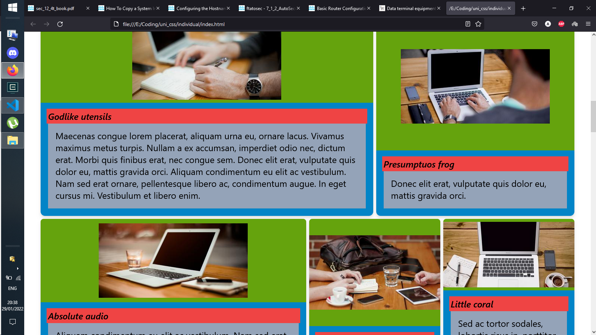
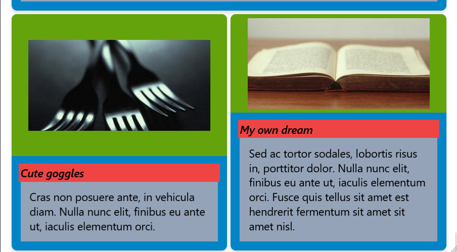
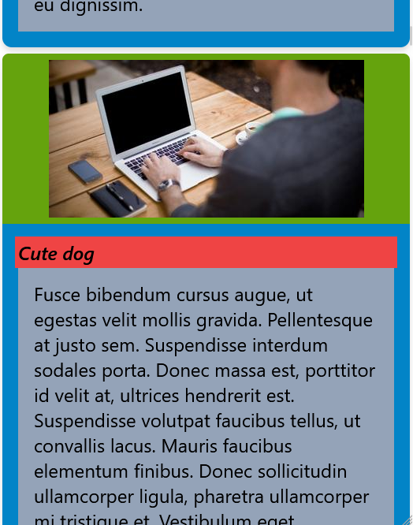
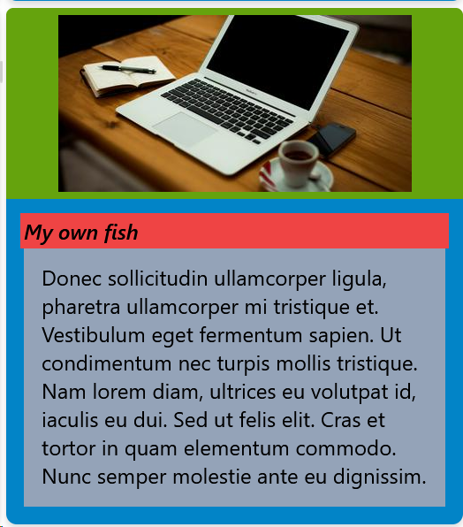
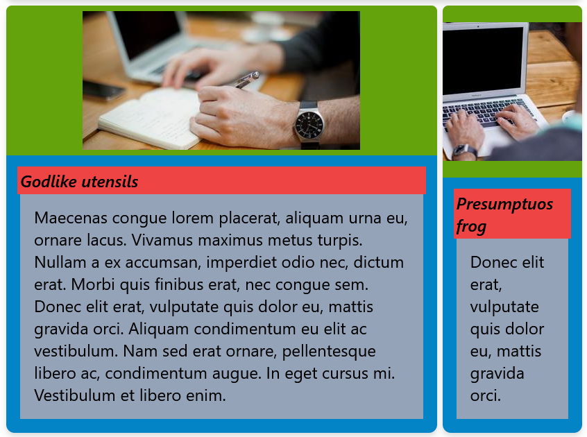

# Lucrul individual la Dezvoltarea Interfețelor Adaptive

A realizat: **Curmanschii Anton, IA1901.**


## Introducere

În continuare se explică instrumentele și modalitățile folosite pentru a crea un site static, adaptiv, unde contentul de pe pagină este generat aleator.
Scopul lucrării a fost de a demostra cum să utlizeze framework-ul [Tailwind](https://tailwindcss.com/) în combinația cu [VueJS](https://vuejs.org/) pentru crearea unui design adaptiv. 
Crearea unui design simpatic este în afară scopului acestei lucrări.

Pentru a atinge un design adaptiv s-au folosit capacitățile framework-ului Tailwind, în special modificatorii claselor HTML ce corespund aplicării regulelor Media Queries în CSS, și pentru alinierea itemilor s-au folosit clasele ajutătoare flexbox care tot sunt definite de Tailwind.

<style>
img[alt^="medium"] { width: 500px; }
img[alt^="small"] { width: 400px; }
img + em { display: block; }
</style>


*Layout-ul pe ecranul mare*


*Layout-ul pe ecranul mediu*


*Layout-ul pe ecranul mic*


## Generarea datelor

Toți itemii sunt constituite din 3 elemente:

- Un titlu aleator;
- O imagine aleatoare;
- Unul sau mai multe paragrafe de Lorem Ipsum.

Datele sunt generate într-un script în JavaScript.
Funcția principală ce realizează generarea datelor se poate vedea mai jos.

```js
const PictureWidth  = 400;
const PictureHeight = 200;
const StringLengthWidthTierBreakpoints = [100, 200, 500];

function getRandomItems(numItems)
{
    let result = [];
    const titlesStart = [/* 11 random things */];
    const titlesEnd = [/* 13 random things */];
    const loremIpsum = [/* random paragraphs of lorem ipsum */];

    numItems = Math.min(numItems, titlesStart.length * titlesEnd.length);

    function getWidthTier(textLength)
    {
        for (let i = 0; i < StringLengthWidthTierBreakpoints.length; i++)
        {
            if (textLength < StringLengthWidthTierBreakpoints[i])
                return i;
        }
        return StringLengthWidthTierBreakpoints.length;
    }

    for (let i = 0; i < numItems; i++)
    {
        let titleStartIndex = i % titlesStart.length;
        let titleEndIndex = i % titlesEnd.length;
        
        let randomImageId = i % 500; 
        
        let loremIndex = i % loremIpsum.length;
        function more(text0, indexOffset)
        {
            if (Math.random() > 0.5)
                return text0 + " " + loremIpsum[(loremIndex + indexOffset) % loremIpsum.length];
            return text0;
        }

        let text = loremIpsum[loremIndex];
        text = more(text, 1);
        text = more(text, 2);

        result[i] = {
            title: titlesStart[titleStartIndex] + " " + titlesEnd[titleEndIndex],
            text: text,
            widthTier: getWidthTier(text.length),
            picture: `https://picsum.photos/id/${randomImageId}/${PictureWidth}/${PictureHeight}`
        };
    }
    return result;
}
```

Cum se poate vedea, fiecare item este atribuit un tir (indice) aleator, conform lungimii textului.
În continuare, tirul acesta se va folosi pentru a determina cât spațiu un anumit item va ocupa în viewport.


## Explicații layout-ului itemilor

Datele asociate cu fiecare item sunt prezentate pe ecran în forma de un card cu imaginea, titlul și textul.



Pentru moment vom neglija layout-ul intern și ne vom concentra pe cel extern.
Ideea este că fiecare așa item va cere o fracție variabilă din spațiul viewport-ului.
Fracția aceasta este în raport cu 4, adică ecranul este subdivizat în 4 sloturi, iar un item va ocupa un oarecare număr de așa sloturi.
Urmează un exemplu, unde itemul din stângă ocupă $ \frac{3}{4} $ de viewport, deci 3 sloturi din cele 4 posibilie, iar cel din dreapta ocupă acel singur slot care rămâne.



Mai însă avem o restricție referitor la layout: dacă un grup de itemi ce se află într-o singură linie nu cere întregul spațiu ce rămâne, dar încă un item în plus nu se încape, dorim ca spațiul ce rămâne să fie subdivizat egal între acei itemi existenți.
Exemplu: avem un item ce se află primul într-o linie ce ocupă 3 sloturi, și mai avem un item ce ocupă 2 sloturi. Deoarece al doilea item nu se încape, primul item va fi intins să ocupe întreaga linie.
Încă un exemplu: avem 3 itemi care ocupă câte un slot, și mai avem unul ce ocupă 2. Deoarecele ultimul item nu se încape, spațiul acelui singur slot ce rămâne va fi subdivizat între cele 3 itemi, astfel fiecare din ele va ocupa câte o treime din spațiul liniei.


Atingem cerințele enumărate în următorul mod:

- Fiecare item este un div ce se află într-un singur div-container;
- div-ul din exterior are `flexbox`; `flex-wrap` ca itemii să treacă la următoarea linie automat;
- Controlăm cât spațiu va lua fiecare item folosind `flex-basis`;
- Mitigăm acea restricție ce ține de situația când itemii trebuie să ocupe mai mult spațiu decât ei cer inițial prin `flex-grow`.


## Adaptivitatea

În secția anterioară am atins responsivitatea (adică faptul că elementele ocupă un procent anumit de spațiu), dar nu adaptivitatea (că layout-ul se schimbă într-un mod în dependența de mărimea ecranului).
Adaptivitatea se obține prin folosirea lor Media Query.
Ideea este că fiecare item va ocupa o fracție variabilă din spațiul viewport-ului în funcția mărimii ecranului.

Aceasta s-a atins prin setarea lui `flex-basis` la valori diferite în funcția de mărimea ecranului.
La fiecare item se aplică clasele CSS definite de Tailwind care dau acea valoare `flex-basis` ce se schimbă pe ecrane de mărimi diferite.

În codul de mai jos, am tabloul cu patru elemente care este indexat cu acele tiruri prescrise fiecărui element, menționate în punctul [despre generare a datelor](#generarea-datelor).
`TierMaxWidth` este acea constantă arbitrară de 4 care indică numărul total de sloturi.

```js
const TierPortions = [
    { small: 4, medium: 1, large: 1 },
    { small: 4, medium: 2, large: 1 },
    { small: 4, medium: 3, large: 2 },
    { small: 4, medium: 4, large: 2 },
];

const TierMaxWidth = 4;
```

Iar aici este definită funcția `itemTierToWidthClass` ce mapează un anumit tir la acele clase Tailwind.
Ca exemplu, dacă tir-ul a fost 0, vom primi clasele `sm:basis-4/4 md:basis-1/4 lg:basis-1/4`.
Deci un item din tir 0 pe ecrane mici va ocupa întregul spațiu al unei linii, iar pe ecranele mari și medii doar o pătrime din spațiu.

```js
{
    itemTierToWidthPortion: function(tier)
    {
        return TierPortions[tier];
    },

    itemTierToWidthClass: function(tier)
    {
        let t = this.itemTierToWidthPortion(tier);
        return `sm:basis-${t.small}/${TierMaxWidth} 
                md:basis-${t.medium}/${TierMaxWidth} 
                lg:basis-${t.large}/${TierMaxWidth}`;
    },
}
```

## Atingerea specificației layout-ului în HTML


### Containerul din exterior

În exterior avem acel container care să aibă `flexbox` și `flex-wrap`.
I-am dat și un pic de margin din stânga și din dreapta în dependența de mărimea ecranului.

```html
<div id="app"
     class="flex 
            flex-wrap
            
            lg:mr-10
            lg:ml-10

            md:mr-5
            md:ml-5">
```


### Conceptul de iterare în VueJS

Ca să nu repetăm același markup HTML, cu toate clasele Tailwind aplicate, putem folosi atributul `v-for` din VueJS care permite iterarea pe itemii noștri.

În primul rând, se aplică toate funcționalitățile framework-ului VueJS la un element după id.
Aceasta se face prin crearea unui obiect (unei componente) în JavaScript.
Tot aici punem și datele referitoare la itemi (mai jos mai sunt metodele, le-am omis pentru claritate).

```js
var app = new Vue(
{
    el: "#app",
    data:
    {
        items: getRandomItems(NumRandomItems)
    },
    // ...
});
```

Acum, în HTML, folosim iterarea.
Ca să fie clar, `v-for` pune acest element de atâtea ori, câte elemente avem în tabloul `items`.

```html
<div v-for="(item, index) in items" 
     v-bind:key="item.title"
     class="grow"
     :class="itemTierToWidthClass(item.widthTier)">

    <!-- ... -->
```


### Design-ul interior al unui item

Itemul din interior este un div imbricat necesar pentru a avea acea culoare albastră de fundal.
Trebuie să ocupe întregul spațiu oferit de părinte, evident de ce.
Div-ul este și el flexbox, deoarece mai departe aliniem imaginea și textul între sine.

```html
<div class="h-full
            w-full
            
            bg-sky-600 

            rounded-xl

            flex
            flex-col
            justify-center
            content-center
            
            overflow-hidden
            drop-shadow-lg">
```

Acest div conține încă două div-uri, unul pentru imagine, unul pentru text.

Div-ul pentru imagine este și el flex pentru centrarea imaginii, are o culoare de fundal verde.
Înăuntru se conține imaginea cu clasa `object-none`.
Această clasă face ca imaginea mereu să rămâne de mărimea sa inițială, iar dacă nu încape în container-ul părinte, să fie cropată egal din toate părțile.
Atributuri care încep `:` asociează acelui atribut valoarea unei variabile din cod.


```html
<div class="w-full 
            flex 
            pt-2
            pb-2
            
            grow

            justify-center
            bg-lime-600">

    
```


Design-ul titlului și textului... Nu-i atât de mult de explicat. 
Doar momentul cu acel span cu poziția absolută, dar aceasta să fiu sincer eu am copiat din documentația și un pic am schimbat.
În sfârșit, aceasta de fapt face dă un fundal roz care într-un fel iese din container-ul inițial.
`skew` de fapt nu este apris (este atât de mic că nici nu-i vizibil), deci puteți de fapt ignora șmecheriile cu acel element absolut cu totul.

```html
<div class="text-2xl 
            p-5
            bg-slate-400
            bg-clip-content">

    <div class="relative
                font-large
                font-semibold 
                text-black
                italic">

        <span class="block 
                     absolute 
                     -inset-1 
                     -skew-y-0.5 
                     bg-red-500" 
              aria-hidden="true">
        </span>

        <span class="relative">
            {{ item.title }}
        </span>
    </div>
    
    <div class="p-5">
        <p class="">{{ item.text }}</p>
    </div>
</div>
```

<!-- 

Nevermind, it works. Even though I'm sure I have tested that and one single pixel would still peek through.

### Hack-ul oribil 1: colțurile rontunjite.

Dev-ul imbricat în div-ul itemului, cum puteți observa, conține `rounded-xl` (colțurile rontunjite, foarte mare), iar itemii din interiorul conțin colțurile rotunjite lg, pe părțile diferite. 
Div-ul de sus (cu imaginea) are colțurile din sus din dreapta și din stânga rotunjite, iar cea din jos — colțurile din jos.
Deci sunt rotunjite de fapt doar colțurile părintelui.


Dar aceasta este prost.
Puteți zice: "de ce să nu folosești overflow hidden la acel div și să scoți colțurile rotunjite de la fii?".
Deoarece atunci avem un pixel din background-ul copiilor vizibil care totuși iese din părinte: -->


### Hack-ul oribil

Nu putem folosi margin între containeri care conțin itemii, deoarece atunci ei vor putea ocupa mai mult spațiu decât sunt prescriși.
De exemplu, dacă avem două itemi care să ocupe $ \frac{2}{4} $ trebuie să ocupe o singură linie, dar vor ocupa din cauza margin-ului un pic mai mult, și aceasta ar forța un break nedorit.

Există două soluții, ambele sunt hack-uri, după opinia mea:

- Să se divizeze spațiul în 5 sloturi în loc de 4, cu toate că alinierea se va concepe ca și cum să existe doar 4 sloturi.
  Sper că este clar de ce acest hack este și mai oribil decât al doilea hack.
- Să se pună div-ul imbricat în încă un div, cu culoarea de fundal transparentă, care să aibă un anumit padding în loc de margin.
  Consider aceasta un hack, deoarece crește complexitatea.
 
> Am încercat să folosesc `grid-gap`, dar în Tailwind el parcă lucrează prin atribuirea unui margin la element-fiu.
> Presupun așa deoarece a avut același efect ca descris mai sus, ca și aplicarea unui margin.

Deci, div-ul imbricat este imbricat de încă o dată.

```html
<div class="h-full
            w-full
            p-1">
```